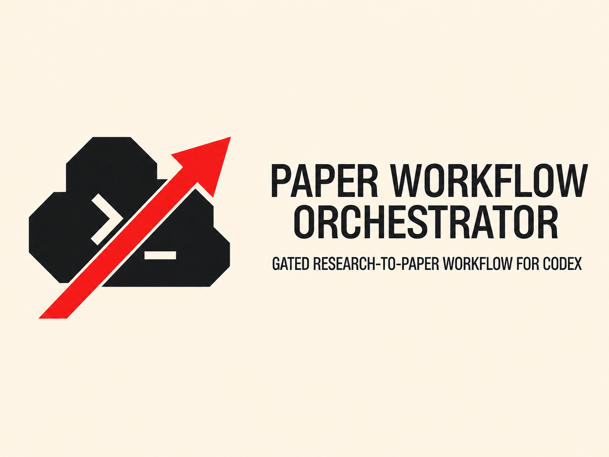

# Paper Workflow Orchestrator

[简体中文](README.zh-CN.md) | **English**

> An auditable, gated research-to-paper workflow controller for Codex — evidence-tracked, integrity-gated, and safe by default.


## Overview

Paper Workflow Orchestrator is a Codex skill that organizes the full research-to-paper pipeline — from idea, literature, and study design through experimentation, writing, integrity audit, peer review, revision, and AI handoff — into a stage-gated, evidence-tracked process.

The main model acts as editor-in-chief: it owns routing, the evidence ledger, prompt design, conflict resolution, and final synthesis. Codex-internal subagents execute only bounded, independently reviewable tasks. Every stage ends with a confirmation gate; the workflow never advances silently.

## Features

Each feature maps to a concrete component in this repository:

| Feature | Implementation |
|---|---|
| Stage-gated workflow with user confirmation gates | `SKILL.md`, `references/stage-contracts.md` |
| Durable evidence ledger & progress memory (v0.4) | `scripts/progress_manager.py`, `references/progress-schema.md` |
| Critical validity blockers halt the pipeline | `references/progress-schema.md`, `SKILL.md` |
| Format-safe humanizer adapter (fail-closed) | `scripts/humanizer_preflight.py`, `references/humanizer-adapter.md` |
| Safe autonomous experiment routing | `scripts/experiment_contract_validator.py`, `SKILL.md` |
| Paper section contract validation | `scripts/paper_section_validator.py`, `references/paper-section-contract.md` |
| Four entry modes (guided idea, draft audit, write/revise, experiment) | `SKILL.md` |
| Bounded subagent delegation contract | `references/stage-contracts.md` |
| Concurrent-safe append-only event log | `scripts/progress_manager.py`, `tests/test_workflow_v04.py` |
| Zero runtime dependencies (Python stdlib only) | all `scripts/*.py` |

## Workflow Stages

The orchestrator routes one primary downstream skill per stage. Each stage produces required artifacts and ends with a user gate.

1. **Intake** — diagnose input, confirm entry mode and constraints
2. **Directions** — explore 3–5 candidate research directions
3. **Literature** — discover and triage verified sources
4. **Topic** — gap / contribution / feasibility verdict and question lock
5. **Design** — falsifiable study design and experiment matrix
6. **Architecture** — freeze paper structure, section profile, outline
7. **Drafting** — bounded internal agents write sections; main model synthesizes
8. **Integrity** — audit citations, numbers, claims, leakage, reproducibility
9. **Naturalization** — format-safe humanizer pass with claim/evidence diff
10. **Review** — peer-review simulation and revision matrix
11. **Finalize** — final audit, handoff card, and delivery

At every gate the user receives completed work, a progress snapshot, remaining risks, 2–5 next-step options (one marked **Recommended**), and the exact confirmation needed to continue. The abstract is written only after the body, results, interpretation, and conclusion are stable; a conclusion is always mandatory.

## Project Structure

```
paper-workflow-orchestrator/
├── SKILL.md                          # Orchestrator skill definition & routing
├── agents/
│   └── openai.yaml                   # Agent interface declaration
├── references/
│   ├── paper-section-contract.md     # Title/abstract/methods/results/conclusion contract
│   ├── progress-schema.md            # Progress memory v0.4 schema & error rules
│   ├── stage-contracts.md            # Stage table, delegation & acceptance predicates
│   └── humanizer-adapter.md          # Format-safe humanizer adapter protocol
├── scripts/
│   ├── progress_manager.py           # Progress init/validate/migrate/record/restore
│   ├── humanizer_preflight.py        # Humanizer preflight (fail-closed)
│   ├── paper_section_validator.py    # Section order & required-section checks
│   └── experiment_contract_validator.py  # Bounded experiment contract validator
└── tests/
    ├── __init__.py
    └── test_workflow_v04.py          # End-to-end workflow tests
```

## Installation

Copy this directory into your Codex skills folder (`CODEX_HOME/skills`, defaults to `~/.codex/skills` when `CODEX_HOME` is unset).

**Windows PowerShell:**

```powershell
Copy-Item -Recurse -Force . $env:CODEX_HOME\skills\paper-workflow-orchestrator
```

**macOS / Linux:**

```bash
cp -R . "$HOME/.codex/skills/paper-workflow-orchestrator"
```

Reload Codex or refresh the skills list after installing.

## Usage

Trigger the full workflow with:

```
Use paper-workflow-orchestrator to run a gated, evidence-tracked research-to-paper workflow.
```

This skill is a workflow controller, not a single-task tool. When you only need a literature matrix, study design, prose polishing, or citation audit, let `research-skill-router` select a narrower dedicated skill instead of loading the full pipeline.

## Local Validation

The scripts use only the Python standard library. With Python 3.10+:

```bash
python -B tests/test_workflow_v04.py -v
# or
python -B -m unittest discover -s tests -p "test_*.py" -v
```

The suite validates progress v0.4, paper-section gates, humanizer fail-closed contracts, critical blockers, concurrent writes, experiment-contract boundaries, and safe routing. When Codex external integration skills are not installed, mirror tests keep local assertions and skip external integration checks.

## Safety Boundaries

- `autoresearch` is never auto-loaded and never starts unattended experiments without an explicit, complete, validated contract.
- Subagents cannot change the research direction, edit the final manuscript, write `progress.md` directly, or fabricate citations, numbers, or results.
- The humanizer cannot bypass the format adapter, protected manifest, claim/evidence diff, integrity receipt, or rollback target.
- DOCX, PDF, and LaTeX require a format-specific adapter; when parsing is insufficient the stage stays `blocked`.
- Critical validity problems cannot be concealed by rewriting the abstract, conclusion, or prose style.

## Contributing

Contributions are welcome. Please run the full test suite before submitting changes, and keep all scripts dependency-free (Python standard library only). Do not commit personal papers, `.research/`, `.paper/`, experiment data, credentials, or locally generated caches.

## License

This project is licensed under the [MIT License](LICENSE).
