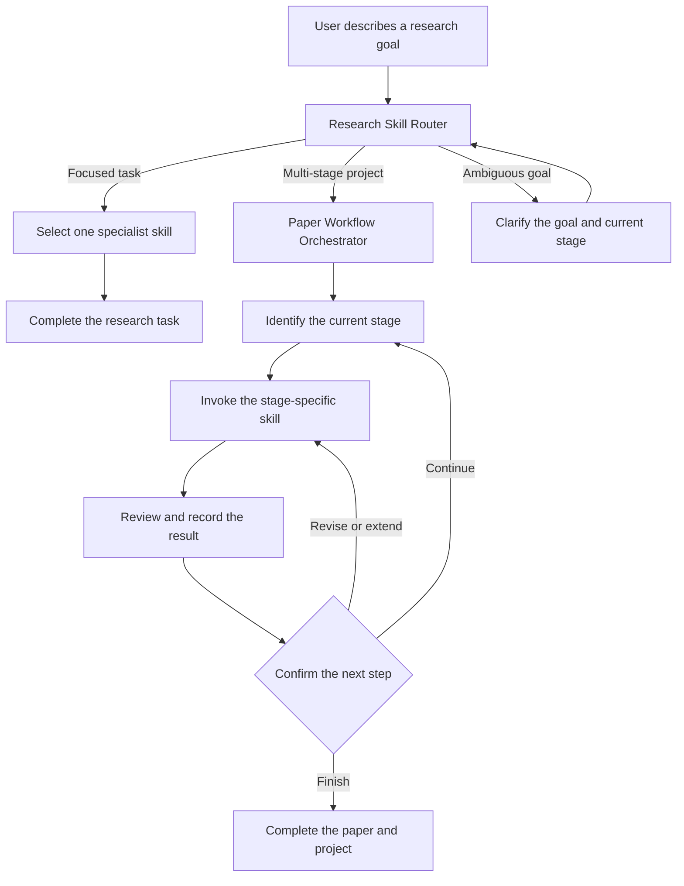
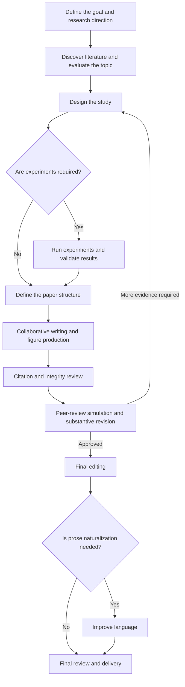
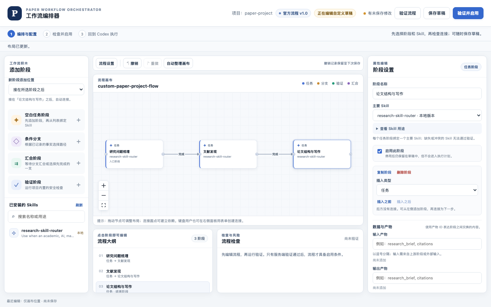

# Paper Workflow Orchestrator

**Helping you turn any vague idea into a paper built to top-journal standards.**

[简体中文](README.zh-CN.md) | **English**


Paper Workflow Orchestrator is a research workflow distributed as a Codex skill package. It selects the right specialist skill for the research goal and current project stage, then connects topic selection, literature, study design, experiments, writing, review, and final delivery into one continuous, traceable paper workflow.

It is designed for paper projects that span multiple files and sessions. You can begin with a vague idea, an existing draft, a confirmed study design, or a bounded experiment. The workflow identifies the current stage, activates the appropriate capability, preserves the important evidence, and pauses for confirmation at consequential decisions.

Release `v1.1.0` adds the optional local Workflow Studio and the confirmed-artifact layer while keeping the official `paper-workflow-orchestrator-v1.0` workflow as the default route.

## Start here

| Your goal | Next step |
|---|---|
| Use the default paper workflow | [Install and start](#quick-installation), then describe your research goal in Codex |
| Arrange your own stages and Skills | [Open the visual editor](#custom-workflow-editor); follow the [three-stage tutorial (Chinese)](docs/workflow-studio-guide.md) |
| Understand or contribute code | Read the [Developer Guide (Chinese)](DEVELOPMENT_GUIDE.md) or [documentation index (Chinese)](docs/README.md) |

Start with the default workflow for your first project. Open Workflow Studio when you want to change stages, replace Skills, or arrange branches.

## Core design: Router Skills

A complete paper project draws on many specialist capabilities: direction exploration, literature discovery, topic evaluation, study design, experiments, academic writing, scientific figures, citation review, and final editing. Paper Workflow Orchestrator adds two layers of Router Skills above those capabilities, so researchers can start from their goal while the routers handle skill selection and sequencing.

- **`research-skill-router` selects the capability**: it interprets the immediate task and research stage, then chooses one primary skill from the available options.
- **`paper-workflow-orchestrator` coordinates the process**: it takes over multi-stage projects, invokes specialist skills in sequence, connects their outputs, and maintains project progress, evidence, and decisions.


```mermaid
flowchart TD
    U["User describes a research goal"] --> R["Research Skill Router"]

    R -->|"Focused task"| S["Select one specialist skill"]
    R -->|"Multi-stage project"| O["Paper Workflow Orchestrator"]
    R -->|"Ambiguous goal"| Q["Clarify the goal and current stage"]
    Q --> R

    S --> T["Complete the research task"]

    O --> C["Identify the current stage"]
    C --> D["Invoke the stage-specific skill"]
    D --> V["Review and record the result"]
    V --> G{"Confirm the next step"}

    G -->|"Continue"| C
    G -->|"Revise or extend"| D
    G -->|"Finish"| F["Complete the paper and project"]
```

### What Router Skills change

**Start with the research goal**

You can ask to “evaluate whether this topic is worth pursuing,” “compare the methods in these papers,” or “continue this paper from an existing draft.” The router maps the request to the appropriate capability and clarifies the scope when the goal is still ambiguous.

**Keep one primary capability in focus**

Direction exploration, topic evaluation, and study design are related, but they solve different problems. The router selects one primary skill for the current stage, keeping the task context focused and reducing interference between overlapping instructions.

**Preserve specialist depth**

Literature discovery, academic writing, scientific visualization, and integrity review remain separate specialist skills. Each capability can be used, upgraded, or replaced independently while continuing to participate in the routed workflow.

**Connect outputs across stages**

Literature evidence shapes topic selection, study design constrains experiments, experimental results determine paper claims, and review findings may send the project back for more evidence. The orchestrator manages these transitions so each validated result becomes usable input for the next stage.

**Support focused tasks and long-running projects**

A narrowly scoped request can go directly to a specialist skill. A request involving a complete paper, durable project state, or multiple research stages enters the orchestrator. The same capability system therefore supports both one-off research tasks and long-running paper projects.

## Progress and current confirmed artifacts

Long-running projects keep two kinds of information separate: **progress records what to do next; the confirmation catalog records which output is currently adopted**. Working drafts can keep changing. After an output passes the relevant checks and you confirm its adoption, the workflow archives it in its artifact folder, updates the current version, and retains both the working source and previous confirmed versions.

Ask to “confirm this checked literature matrix as the current version” or “continue revising the current confirmed manuscript.” Later work resolves the confirmation record instead of choosing an old draft or a newer, unapproved file by its name or timestamp.

Open `artifacts/INDEX.md` to browse current outputs, organized by type and role under `artifacts/current/`. A multi-file deliverable can include the manuscript, figures, and bibliography together. See the [progress and confirmed-artifact guide (Chinese)](docs/progress-and-artifacts-guide.md).

### Where project state lives

The repository contains the workflow tools. Your paper-project directory contains the durable state created while you use them:

```text
paper-project/
├── your-working-files/                 # drafts, data, code, and notes you continue to edit
├── artifacts/
│   ├── INDEX.md                        # readable index of currently confirmed outputs
│   └── current/<type>/<artifact-id>/   # generated view of the latest confirmed bundle
└── .research/
    ├── progress.md                     # official stage, next action, risks, and resume details
    ├── confirmed-artifacts/
    │   ├── catalog.json                # authoritative current-version selection
    │   └── versions/                   # immutable confirmed snapshots
    └── custom-workflow/                # custom plan, run state, events, and receipts
```

`progress.md` answers “what should happen next?”. The confirmation catalog answers “which version should be used?”. The generated `current/` tree is convenient for reading and delivery; the catalog-backed snapshot remains the source used for verification.

## Workflow

The workflow chooses its entry point and route from the state of the project. The diagram below groups the internal stages into five user-facing parts and shows the feedback loops created by experiments, review, and revision.


```mermaid
flowchart TD
    A["Define the goal and research direction"] --> B["Discover literature and evaluate the topic"]
    B --> C["Design the study"]
    C --> D{"Are experiments required?"}

    D -->|"Yes"| E["Run experiments and validate results"]
    D -->|"No"| F["Define the paper structure"]
    E --> F

    F --> G["Collaborative writing and figure production"]
    G --> H["Citation and integrity review"]
    H --> I["Peer-review simulation and substantive revision"]

    I -->|"More evidence required"| C
    I -->|"Approved"| J["Final editing"]

    J --> K{"Is prose naturalization needed?"}
    K -->|"Yes"| L["Improve language"]
    K -->|"No"| M["Final review and delivery"]
    L --> M
```

The user confirms consequential decisions such as topic selection, study design, experiment scope, and final acceptance. Detailed stages, inputs, outputs, and acceptance rules are documented in [`references/stage-contracts.md`](references/stage-contracts.md).

## Features at a glance

Each entry below describes a different user-visible job rather than repeating one generic “workflow” claim.

| When you need to… | The project provides… | Where it is implemented |
|---|---|---|
| Turn an underspecified research request into the right next task | `research-skill-router` reads the intent and current stage, then keeps one primary specialist in focus | `companion-skills/research-skill-router/` |
| Move from a research idea or draft toward a complete paper | The Orchestrator carries the project through gated stages, connects accepted outputs, and asks for confirmation at consequential decisions | `SKILL.md`, `references/stage-contracts.md` |
| Resume after several sessions | A compact progress snapshot records the current stage, next action, risks, rules, and resume details; the event log remains available for audit | `scripts/progress_manager.py`, `references/progress-schema.md` |
| Stop an old draft being mistaken for the adopted result | Explicit confirmation creates an immutable version, updates the role's current pointer, and keeps working files in place for further editing | `scripts/artifact_manager.py`, `scripts/confirmed_artifacts.py`, `references/confirmed-artifacts.md` |
| Check whether an experiment is ready to run | An experiment contract validator checks the question, resources, evaluation plan, and stopping conditions before execution | `scripts/experiment_contract_validator.py` |
| Check a manuscript's shape before deeper review | A section validator parses Markdown headings and code fences, then reports missing or misplaced sections | `scripts/paper_section_validator.py`, `references/paper-section-contract.md` |
| Keep a scientific figure tied to its evidence | A figure contract records data sources, claim links, relationships, and image metadata, then produces a fail-closed receipt | `scripts/figure_contract_validator.py`, `references/scientific-visualization-integration.md` |
| Turn inspected paper figures into an actionable design | `reference-first-figures` transfers design relationships and compares actual exports; `nature-figure` implements applicable Python/R panels | `companion-skills/reference-first-figures/`, `companion-skills/nature-figure/` |
| Review claims and revise a paper | Integrity checks cover citations, numbers, claims, and reproducibility; the review stage turns findings into a substantive revision plan | `SKILL.md`, `references/stage-contracts.md` |
| Edit a stable manuscript without losing protected content | The bundled Final Editor applies manuscript-wide editorial rules and verifies the protected-content receipt | `companion-skills/academic-manuscript-final-editor/` |
| Improve mechanical prose after the science is settled | Humanizer Preflight compares the candidate against protected content and records the content-difference evidence | `scripts/humanizer_preflight.py`, `references/humanizer-adapter.md` |
| Arrange stages without editing JSON | Workflow Studio offers a local graphical canvas for tasks, validators, conditions, parallel branches, joins, inputs, and outputs | `scripts/workflow_studio.py`, `studio/`, `assets/workflow-studio/` |
| Install the same set of skills on another machine | The lock manifest pins sources, commits, licenses, backups, and an installation receipt for `core`, `standard`, or `full` | `dependencies.lock.json`, `scripts/install_workflow.py` |

The orchestrator's core scripts use only the Python standard library and support Python 3.10 or later.

## When to use it

- You have an early research idea and need to turn it into a testable question.
- You have a known set of papers and need to compare their methods, data, claims, and limitations.
- You have chosen a topic and need a study design, experiment plan, and paper structure.
- You have a draft and need to review its citations, claims, figures, and argumentative integrity.
- You need to coordinate multiple rounds of writing, review, revision, and final editing.
- You need project state to persist across multiple Codex sessions.
- You know the research outcome you need and want the router to select the appropriate specialist skill.

## Quick installation

Clone the repository and run the installer:

```bash
git clone https://github.com/shuohui-air-technology/codex-paper-workflow.git
cd codex-paper-workflow
python3 scripts/install_workflow.py
```

If `python` already points to Python 3, the equivalent command is:

```bash
python scripts/install_workflow.py
```

On Windows, use:

```powershell
py -3 scripts/install_workflow.py
```

The installer uses the `standard` profile by default. Reopen Codex or reload the skills list after installation.

Open your paper-project directory in Codex and send:

```text
Use paper-workflow-orchestrator to start the complete paper workflow from my current research materials. Identify the current stage and what you need from me, then guide me through the next step.
```

Continue in the same project to retain its progress. [More usage examples](#usage) cover existing drafts, literature comparisons, and experiments.

For the complete pinned catalog, including the optional experiment and ARA-review skills, install `full` explicitly:

```bash
python3 scripts/install_workflow.py --profile full
```

### Installation profiles

| Profile | Contents | Best for |
|---|---|---|
| `core` | Orchestrator, Research Skill Router, and the bundled final editor | Offline installation and a minimal workflow |
| `standard` | `core` plus research, writing, review, prose-naturalization, and scientific-visualization skills | Most paper projects |
| `full` | `standard` plus autonomous experimentation and ARA review | Projects with a confirmed experiment contract and advanced review requirements |

`standard` and `full` include both figure Skills independently. Use `reference-first-figures` for new/reference-led designs, and `nature-figure` for applicable Python/R implementation, statistics and export QA. Preserve the chosen backend and approved design; small corrections retain the current tool. Plotting runtimes are prepared separately from Skill installation.

Common commands:

```bash
# Preview the standard installation
python3 scripts/install_workflow.py --profile standard --dry-run

# Verify the current installation
python3 scripts/install_workflow.py --profile standard --verify

# Update to the versions recorded in the lock file
python3 scripts/install_workflow.py --profile standard --update

# Reduce an existing installation to core, backing up and pruning managed skills
python3 scripts/install_workflow.py --profile core --update --prune
```

`dependencies.lock.json` records the repository, path, fixed commit, and license for every external skill. The installer uses that manifest for download, validation, and updates, then writes a local `.paper-workflow-install.json` installation record.

The `core` profile supports offline installation. The `standard` and `full` profiles retrieve the external skills recorded in the manifest over HTTPS and require access to GitHub.

The scientific-figure workflow uses Python 3.11+, `uv`, and the plotting libraries selected for the task. Configure that Python runtime after installing the skills.

## Custom workflow editor

Studio includes a reference-led figure template: design, drawing, human confirmation, visual comparison and validation. See the [template guide (Chinese)](docs/workflow-studio-guide.md#参考优先绘图流程). GIS/native-vector work retains its existing tools; mixed figures can hand only named quantitative panels to `nature-figure`.

The official v1.0 workflow remains the default and is ready to use after installation. Advanced users who want to arrange their own stages can open the visual editor from a paper-project directory. The [Workflow Studio guide (Chinese)](docs/workflow-studio-guide.md) walks through a three-stage workflow: organize literature, draft an introduction, and review the draft.

From your paper-project directory, run this command on macOS or Linux:

```bash
python3 "${CODEX_HOME:-$HOME/.codex}/skills/paper-workflow-orchestrator/scripts/workflow_studio.py" --project .
```

`--project .` selects the current paper-project directory. Your browser opens automatically; keep the terminal running while using Studio.

<details>
<summary>Windows and custom installation directories</summary>

If you installed to a custom Codex home, export `CODEX_HOME` with that same path in the shell where you launch Studio so the Studio process can use it too. The installer's setting is not automatically reused in a later shell; if you do not set it, the command looks under `~/.codex`. On Windows PowerShell, run:

```powershell
$skillsHome = if ($env:CODEX_HOME) { Join-Path $env:CODEX_HOME 'skills' } else { Join-Path $HOME '.codex\skills' }
py -3 (Join-Path $skillsHome 'paper-workflow-orchestrator\scripts\workflow_studio.py') --project .
```

On macOS or Linux, set a custom path and start Studio in the same terminal like this:

```bash
export CODEX_HOME="/path/to/codex-home"
python3 "$CODEX_HOME/skills/paper-workflow-orchestrator/scripts/workflow_studio.py" --project .
```

</details>

Start from a copy of the official workflow or create a blank one. Arrange stages on the canvas, choose Skills that are already installed, connect steps, and add conditions, parallel branches, or joins. Review validation results and any risk notices before activating the custom workflow. The editor works without editing JSON; Skill installation remains a separate installer step. Its runtime needs Python 3.10 or later but no Node.js.

Follow the sequence: edit stages, validate, then save or activate. Saving preserves a draft; activation selects the workflow that Codex will follow. The [guide (Chinese)](docs/workflow-studio-guide.md) explains saved drafts, active versions, artifact connections, and common errors.

When you copy the official workflow, four high-impact checkpoints are added as
waiting gates: topic lock, study-design confirmation, experiment authorization,
and final delivery. A gate keeps the original artifact edges in place, but the
downstream stage stays unavailable until you explicitly approve the exact
upstream attempt. A revision request preserves the old receipt and makes the
source closure stale; use the manager's explicit `rerun-stale` command after
reviewing it.

New custom activations also use a fixed Skill root and the `node-result-v2`
source declaration. A task must report the project-relative files it actually
used and their SHA-256 hashes. The manager checks those entries against the
frozen claim and stores them in `stage-receipt-v3` for recovery replay. This is
an auditable declaration of reported inputs; without OS-level file-access
isolation it cannot prove that an executor did not read an unreported file.

After Studio confirms activation, return to a Codex conversation in the same paper-project directory and send:

```text
Use paper-workflow-orchestrator to continue the custom workflow I activated for this project. Check its current mode and ready stages, tell me what you need for the next stage, and then guide me through the workflow.
```



## Additional installation options

The installer above is the usual entry point. The following commands are available for copying bundled Skills manually. Manual copying does not create an installer receipt; Studio identifies these Skills as local versions.

<details>
<summary>Manual installation of bundled skills</summary>

### Windows PowerShell

Run from the repository root:

```powershell
$skillsHome = if ($env:CODEX_HOME) { Join-Path $env:CODEX_HOME 'skills' } else { Join-Path ([Environment]::GetFolderPath('UserProfile')) '.codex\skills' }
$main = Join-Path $skillsHome 'paper-workflow-orchestrator'
New-Item -ItemType Directory -Force -Path $main | Out-Null
Copy-Item -Recurse -Force SKILL.md, agents, assets, references, scripts $main
Copy-Item -Force LICENSE (Join-Path $main 'LICENSE')

$finalEditor = Join-Path $skillsHome 'academic-manuscript-final-editor'
$router = Join-Path $skillsHome 'research-skill-router'
New-Item -ItemType Directory -Force -Path $finalEditor, $router | Out-Null
Copy-Item -Recurse -Force companion-skills\academic-manuscript-final-editor\* $finalEditor
Copy-Item -Recurse -Force companion-skills\research-skill-router\* $router
```

### macOS / Linux

Run from the repository root:

```bash
SKILLS_HOME="${CODEX_HOME:-$HOME/.codex}/skills"
mkdir -p "$SKILLS_HOME/paper-workflow-orchestrator"
cp -R SKILL.md agents assets references scripts "$SKILLS_HOME/paper-workflow-orchestrator/"
cp -f LICENSE "$SKILLS_HOME/paper-workflow-orchestrator/LICENSE"

mkdir -p "$SKILLS_HOME/academic-manuscript-final-editor" "$SKILLS_HOME/research-skill-router"
cp -R companion-skills/academic-manuscript-final-editor/. "$SKILLS_HOME/academic-manuscript-final-editor/"
cp -R companion-skills/research-skill-router/. "$SKILLS_HOME/research-skill-router/"
```

</details>

## Usage

### Start the complete paper workflow

```text
Use paper-workflow-orchestrator to continue from the current research materials with stage confirmation and durable progress tracking.
```

### Start from an existing draft

```text
Use paper-workflow-orchestrator to audit this draft, identify the current stage and evidence gaps, and propose the next revision plan.
```

### Let the router choose a specialist skill

```text
Use research-skill-router to choose the right skill for this task: compare the methods, data, and main claims in these papers.
```

### Start a bounded experiment

```text
Use paper-workflow-orchestrator to define an experiment contract and confirm its goal, resources, evaluation method, and stopping conditions before execution.
```

The `research-skill-router` selects a specialist capability for a focused research task. The `paper-workflow-orchestrator` manages tasks that require multiple stages or durable project state.

## Repository structure

```text
paper-workflow-orchestrator/
├── SKILL.md                              # Orchestrator definition and stage routing
├── agents/
│   └── openai.yaml                       # Agent interface declaration
├── assets/                               # Logo, README banner, screenshot, and offline Studio bundle
│   ├── workflow-studio.png               # Workflow Studio screenshot
│   └── workflow-studio/                  # Prebuilt runtime; no Node.js required by users
├── references/
│   ├── paper-section-contract.md         # Paper-section contract
│   ├── progress-schema.md                # Project progress and evidence format
│   ├── confirmed-artifacts.md            # Confirmed versions, index, and recovery
│   ├── stage-contracts.md                # Stage, delegation, and acceptance rules
│   ├── scientific-visualization-integration.md
│   ├── final-editor-integration.md
│   └── humanizer-adapter.md
├── scripts/
│   ├── progress_manager.py               # Progress initialization, migration, recording, and recovery
│   ├── artifact_manager.py               # Confirmation lookup, adoption, withdrawal, and repair
│   ├── confirmed_artifacts.py            # Version snapshots and current-output folders
│   ├── install_workflow.py               # Cross-platform fixed-version installer
│   ├── workflow_studio.py                # Visual editor launcher
│   ├── workflow_manager.py               # Custom workflow execution and state interface
│   ├── workflow_engine/                  # Validation, scheduling, storage, and local Studio service
│   ├── experiment_contract_validator.py  # Experiment-contract validation
│   ├── figure_contract_validator.py      # Scientific-figure validation
│   ├── paper_section_validator.py        # Paper-section validation
│   ├── final_edit_receipt_validator.py   # Final-edit result validation
│   └── humanizer_preflight.py            # Prose-naturalization preflight
├── dependencies.lock.json                # External skill sources and version manifest
├── studio/                               # Workflow Studio frontend source
├── docs/                                 # User tutorials, development records, and documentation index
├── tests/                                 # Workflow and installer tests
└── companion-skills/
    ├── research-skill-router/             # Research-task routing entry point
    ├── reference-first-figures/           # Reference-led design and visual comparison
    ├── nature-figure/                    # Python/R figure implementation and export checks
    └── academic-manuscript-final-editor/  # Final editing
```

## Third-party skill sources

External skills are retrieved at the fixed commits recorded in [`dependencies.lock.json`](dependencies.lock.json). The manifest also records each upstream project's license:

- K-Dense scientific visualization: MIT
- research-hub: MIT
- Orchestra AI Research Skills: MIT
- humanizer: MIT
- Academic Research Skills: CC BY-NC 4.0

The pinned upstream repository for `clarify-research-idea` does not currently declare a license. Review its terms separately before use or redistribution.

Each upstream project's original license continues to apply after skill installation.

## Contributing

Issues and improvements are welcome. Code contributions should keep the orchestrator's core scripts within the Python standard library and describe the verification performed in the pull request.

Contributors can start with the [Developer Guide](DEVELOPMENT_GUIDE.md), which explains the repository layout, local test commands, and how the Python runtime and Workflow Studio fit together.

The [documentation index (Chinese)](docs/README.md) groups user instructions and implementation contracts by purpose.

Keep personal papers, `.research/`, `.paper/`, experimental data, credentials, and machine-generated caches local and managed through `.gitignore`.

## License

This project is released under the [MIT License](LICENSE).
