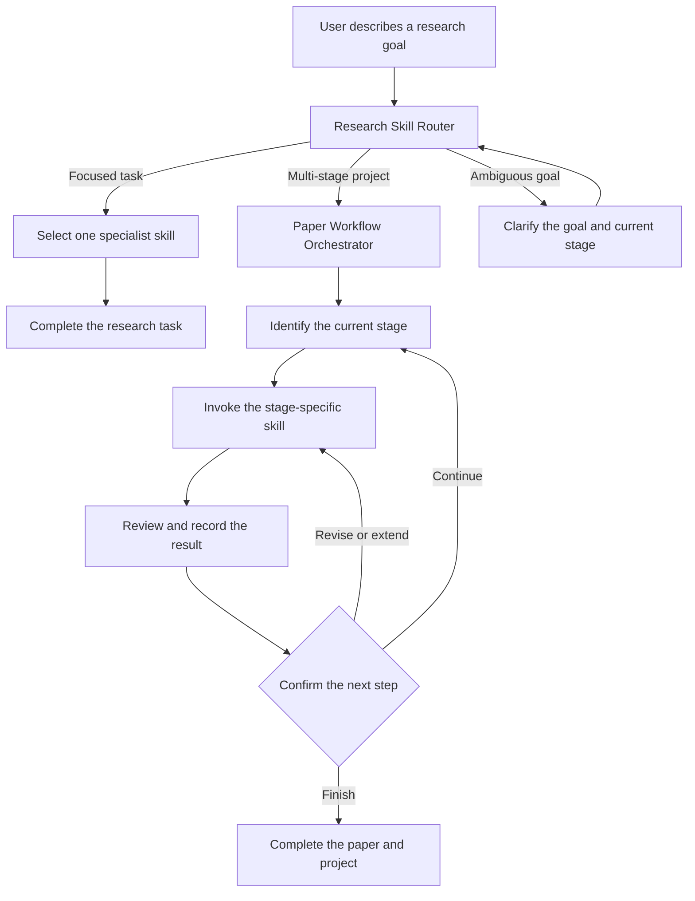
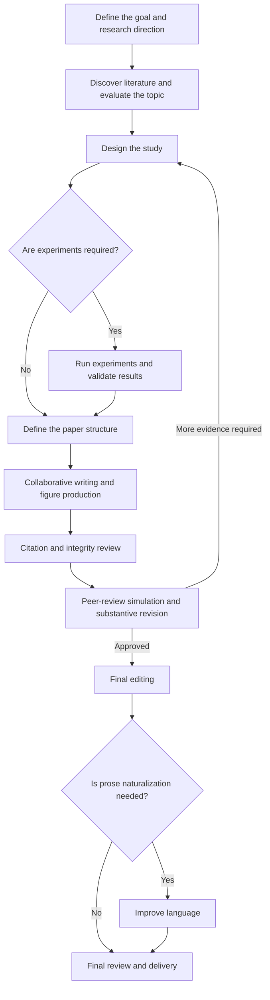

# Paper Workflow Orchestrator

**Helping you turn any vague idea into a paper built to top-journal standards.**

[简体中文](README.zh-CN.md) | **English**


Paper Workflow Orchestrator is a research workflow distributed as a Codex skill package. It selects the right specialist skill for the research goal and current project stage, then connects topic selection, literature, study design, experiments, writing, review, and final delivery into one continuous, traceable paper workflow.

It is designed for paper projects that span multiple files and sessions. You can begin with a vague idea, an existing draft, a confirmed study design, or a bounded experiment. The workflow identifies the current stage, activates the appropriate capability, preserves the important evidence, and pauses for confirmation at consequential decisions.

## Core design: Router Skills

A complete paper project draws on many specialist capabilities: direction exploration, literature discovery, topic evaluation, study design, experiments, academic writing, scientific figures, citation review, and final editing. Paper Workflow Orchestrator adds two layers of Router Skills above those capabilities, so researchers can start from their goal while the routers handle skill selection and sequencing.

- **`research-skill-router` selects the capability**: it interprets the immediate task and research stage, then chooses one primary skill from the available options.
- **`paper-workflow-orchestrator` coordinates the process**: it takes over multi-stage projects, invokes specialist skills in sequence, connects their outputs, and maintains project progress, evidence, and decisions.


```mermaid
flowchart TD
    U["User describes a research goal"] --> R["Research Skill Router"]

    R -->|"Focused task"| S["Select one specialist skill"]
    R -->|"Multi-stage project"| O["Paper Workflow Orchestrator"]
    R -->|"Ambiguous goal"| Q["Clarify the goal and current stage"]
    Q --> R

    S --> T["Complete the research task"]

    O --> C["Identify the current stage"]
    C --> D["Invoke the stage-specific skill"]
    D --> V["Review and record the result"]
    V --> G{"Confirm the next step"}

    G -->|"Continue"| C
    G -->|"Revise or extend"| D
    G -->|"Finish"| F["Complete the paper and project"]
```

### What Router Skills change

**Start with the research goal**

You can ask to “evaluate whether this topic is worth pursuing,” “compare the methods in these papers,” or “continue this paper from an existing draft.” The router maps the request to the appropriate capability and clarifies the scope when the goal is still ambiguous.

**Keep one primary capability in focus**

Direction exploration, topic evaluation, and study design are related, but they solve different problems. The router selects one primary skill for the current stage, keeping the task context focused and reducing interference between overlapping instructions.

**Preserve specialist depth**

Literature discovery, academic writing, scientific visualization, and integrity review remain separate specialist skills. Each capability can be used, upgraded, or replaced independently while continuing to participate in the routed workflow.

**Connect outputs across stages**

Literature evidence shapes topic selection, study design constrains experiments, experimental results determine paper claims, and review findings may send the project back for more evidence. The orchestrator manages these transitions so each validated result becomes usable input for the next stage.

**Support focused tasks and long-running projects**

A narrowly scoped request can go directly to a specialist skill. A request involving a complete paper, durable project state, or multiple research stages enters the orchestrator. The same capability system therefore supports both one-off research tasks and long-running paper projects.

## Workflow

The workflow chooses its entry point and route from the state of the project. The diagram below groups the internal stages into five user-facing parts and shows the feedback loops created by experiments, review, and revision.


```mermaid
flowchart TD
    A["Define the goal and research direction"] --> B["Discover literature and evaluate the topic"]
    B --> C["Design the study"]
    C --> D{"Are experiments required?"}

    D -->|"Yes"| E["Run experiments and validate results"]
    D -->|"No"| F["Define the paper structure"]
    E --> F

    F --> G["Collaborative writing and figure production"]
    G --> H["Citation and integrity review"]
    H --> I["Peer-review simulation and substantive revision"]

    I -->|"More evidence required"| C
    I -->|"Approved"| J["Final editing"]

    J --> K{"Is prose naturalization needed?"}
    K -->|"Yes"| L["Improve language"]
    K -->|"No"| M["Final review and delivery"]
    L --> M
```

The user confirms consequential decisions such as topic selection, study design, experiment scope, and final acceptance. Detailed stages, inputs, outputs, and acceptance rules are documented in [`references/stage-contracts.md`](references/stage-contracts.md).

## Core capabilities

| Capability | What the user gets | Primary implementation |
|---|---|---|
| Research-task routing | One primary skill selected from the research intent and current stage | `companion-skills/research-skill-router/` |
| End-to-end paper orchestration | Continuous progress from a research idea or existing draft to final delivery | `SKILL.md`, `references/stage-contracts.md` |
| Project continuity | Progress, evidence, decisions, risks, and stage-transition records | `scripts/progress_manager.py`, `references/progress-schema.md` |
| Research and experiment preparation | A defined research question, validation method, and execution scope before experiments begin | `scripts/experiment_contract_validator.py` |
| Paper-structure validation | Checks for required sections and their order | `scripts/paper_section_validator.py`, `references/paper-section-contract.md` |
| Scientific-figure workflow | Figures bound to source data, paper claims, and validation records | `scripts/figure_contract_validator.py`, `references/scientific-visualization-integration.md` |
| Integrity and peer review | Citation, number, claim, and reproducibility checks followed by substantive revision | `SKILL.md`, `references/stage-contracts.md` |
| Final editing | Manuscript-wide editing with protected-content validation | `companion-skills/academic-manuscript-final-editor/` |
| Prose naturalization | Mechanical prose cleanup after scientific content stabilizes, with content-difference checks | `scripts/humanizer_preflight.py`, `references/humanizer-adapter.md` |
| Reproducible installation | Fixed-source installation through `core`, `standard`, or `full` profiles | `dependencies.lock.json`, `scripts/install_workflow.py` |

The orchestrator's core scripts use only the Python standard library and support Python 3.10 or later.

## When to use it

- You have an early research idea and need to turn it into a testable question.
- You have a known set of papers and need to compare their methods, data, claims, and limitations.
- You have chosen a topic and need a study design, experiment plan, and paper structure.
- You have a draft and need to review its citations, claims, figures, and argumentative integrity.
- You need to coordinate multiple rounds of writing, review, revision, and final editing.
- You need project state to persist across multiple Codex sessions.
- You know the research outcome you need and want the router to select the appropriate specialist skill.

## Quick installation

Clone the repository and run the installer:

```bash
git clone https://github.com/shuohui-air-technology/codex-paper-workflow.git
cd codex-paper-workflow
python3 scripts/install_workflow.py
```

If `python` already points to Python 3, the equivalent command is:

```bash
python scripts/install_workflow.py
```

On Windows, use:

```powershell
py -3 scripts/install_workflow.py
```

The installer uses the `standard` profile by default. Reopen Codex or reload the skills list after installation.

### Installation profiles

| Profile | Contents | Best for |
|---|---|---|
| `core` | Orchestrator, Research Skill Router, and the bundled final editor | Offline installation and a minimal workflow |
| `standard` | `core` plus research, writing, review, prose-naturalization, and scientific-visualization skills | Most paper projects |
| `full` | `standard` plus autonomous experimentation and ARA review | Projects with a confirmed experiment contract and advanced review requirements |

Common commands:

```bash
# Preview the standard installation
python3 scripts/install_workflow.py --profile standard --dry-run

# Verify the current installation
python3 scripts/install_workflow.py --profile standard --verify

# Update to the versions recorded in the lock file
python3 scripts/install_workflow.py --profile standard --update

# Reduce an existing installation to core, backing up and pruning managed skills
python3 scripts/install_workflow.py --profile core --update --prune
```

`dependencies.lock.json` records the repository, path, fixed commit, and license for every external skill. The installer uses that manifest for download, validation, and updates, then writes a local `.paper-workflow-install.json` installation record.

The `core` profile supports offline installation. The `standard` and `full` profiles retrieve the external skills recorded in the manifest over HTTPS and require access to GitHub.

The scientific-figure workflow uses Python 3.11+, `uv`, and the plotting libraries selected for the task. Configure that Python runtime after installing the skills.

<details>
<summary>Manual installation of bundled skills</summary>

### Windows PowerShell

Run from the repository root:

```powershell
$skillsHome = if ($env:CODEX_HOME) { Join-Path $env:CODEX_HOME 'skills' } else { Join-Path ([Environment]::GetFolderPath('UserProfile')) '.codex\skills' }
$main = Join-Path $skillsHome 'paper-workflow-orchestrator'
New-Item -ItemType Directory -Force -Path $main | Out-Null
Copy-Item -Recurse -Force SKILL.md, agents, assets, references, scripts $main
Copy-Item -Force LICENSE (Join-Path $main 'LICENSE')

$finalEditor = Join-Path $skillsHome 'academic-manuscript-final-editor'
$router = Join-Path $skillsHome 'research-skill-router'
New-Item -ItemType Directory -Force -Path $finalEditor, $router | Out-Null
Copy-Item -Recurse -Force companion-skills\academic-manuscript-final-editor\* $finalEditor
Copy-Item -Recurse -Force companion-skills\research-skill-router\* $router
```

### macOS / Linux

Run from the repository root:

```bash
SKILLS_HOME="${CODEX_HOME:-$HOME/.codex}/skills"
mkdir -p "$SKILLS_HOME/paper-workflow-orchestrator"
cp -R SKILL.md agents assets references scripts "$SKILLS_HOME/paper-workflow-orchestrator/"
cp -f LICENSE "$SKILLS_HOME/paper-workflow-orchestrator/LICENSE"

mkdir -p "$SKILLS_HOME/academic-manuscript-final-editor" "$SKILLS_HOME/research-skill-router"
cp -R companion-skills/academic-manuscript-final-editor/. "$SKILLS_HOME/academic-manuscript-final-editor/"
cp -R companion-skills/research-skill-router/. "$SKILLS_HOME/research-skill-router/"
```

</details>

## Usage

### Start the complete paper workflow

```text
Use paper-workflow-orchestrator to continue from the current research materials with stage confirmation and durable progress tracking.
```

### Start from an existing draft

```text
Use paper-workflow-orchestrator to audit this draft, identify the current stage and evidence gaps, and propose the next revision plan.
```

### Let the router choose a specialist skill

```text
Use research-skill-router to choose the right skill for this task: compare the methods, data, and main claims in these papers.
```

### Start a bounded experiment

```text
Use paper-workflow-orchestrator to define an experiment contract and confirm its goal, resources, evaluation method, and stopping conditions before execution.
```

The `research-skill-router` selects a specialist capability for a focused research task. The `paper-workflow-orchestrator` manages tasks that require multiple stages or durable project state.

## Repository structure

```text
paper-workflow-orchestrator/
├── SKILL.md                              # Orchestrator definition and stage routing
├── agents/
│   └── openai.yaml                       # Agent interface declaration
├── assets/                               # Logo and README banner
├── references/
│   ├── paper-section-contract.md         # Paper-section contract
│   ├── progress-schema.md                # Project progress and evidence format
│   ├── stage-contracts.md                # Stage, delegation, and acceptance rules
│   ├── scientific-visualization-integration.md
│   ├── final-editor-integration.md
│   └── humanizer-adapter.md
├── scripts/
│   ├── progress_manager.py               # Progress initialization, migration, recording, and recovery
│   ├── install_workflow.py               # Cross-platform fixed-version installer
│   ├── experiment_contract_validator.py  # Experiment-contract validation
│   ├── figure_contract_validator.py      # Scientific-figure validation
│   ├── paper_section_validator.py        # Paper-section validation
│   ├── final_edit_receipt_validator.py   # Final-edit result validation
│   └── humanizer_preflight.py            # Prose-naturalization preflight
├── dependencies.lock.json                # External skill sources and version manifest
├── tests/                                 # Workflow and installer tests
└── companion-skills/
    ├── research-skill-router/             # Research-task routing entry point
    └── academic-manuscript-final-editor/  # Final editing
```

## Third-party skill sources

External skills are retrieved at the fixed commits recorded in [`dependencies.lock.json`](dependencies.lock.json). The manifest also records each upstream project's license:

- K-Dense scientific visualization: MIT
- research-hub: MIT
- Orchestra AI Research Skills: MIT
- humanizer: MIT
- Academic Research Skills: CC BY-NC 4.0

The pinned upstream repository for `clarify-research-idea` does not currently declare a license. Review its terms separately before use or redistribution.

Each upstream project's original license continues to apply after skill installation.

## Contributing

Issues and improvements are welcome. Code contributions should keep the orchestrator's core scripts within the Python standard library and describe the verification performed in the pull request.

Keep personal papers, `.research/`, `.paper/`, experimental data, credentials, and machine-generated caches local and managed through `.gitignore`.

## License

This project is released under the [MIT License](LICENSE).
