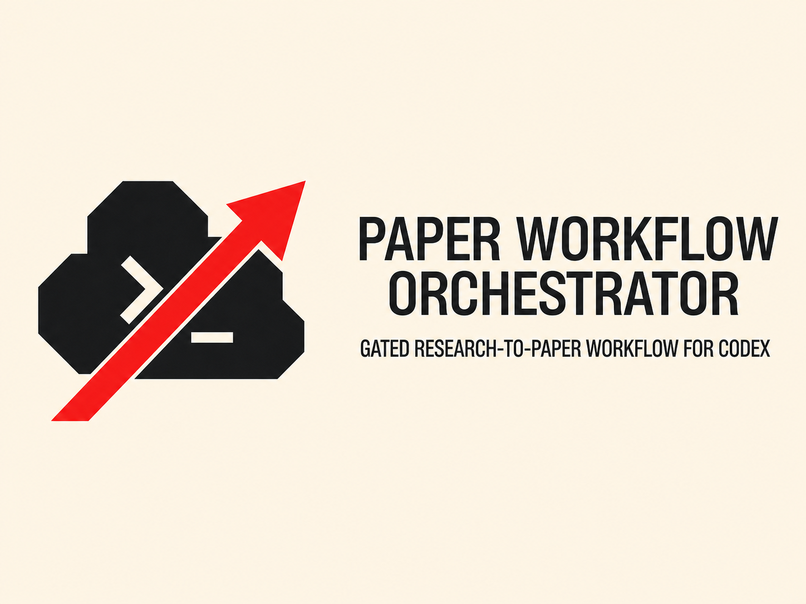

# Paper Workflow Orchestrator

**From vague idea to high-quality paper — a complete workflow controller.**

[简体中文](README.zh-CN.md) | **English**

> Organize research questions, evidence, experiments, and writing in one gated workflow.


**Workflow version: v1.0**

## Overview

Paper Workflow Orchestrator is a Codex skill for the full research-to-paper pipeline. It connects idea development, literature, study design, experiments, writing, integrity checks, peer review, and revision through explicit stages and evidence records.

The main model acts as editor-in-chief. It owns routing, the evidence ledger, prompt design, conflict resolution, and final synthesis. Codex-internal subagents handle bounded tasks that can be reviewed independently. Each stage ends with a confirmation gate, so the workflow does not advance silently.

## Features

Each feature maps to a concrete component in this repository:

| Feature | Implementation |
|---|---|
| 13-stage gated workflow with a user confirmation gate at every stage | `SKILL.md`, `references/stage-contracts.md` |
| Four entry modes: guided idea, draft audit, write/revise, experiment | `SKILL.md` |
| Durable, concurrency-safe append-only progress memory and evidence ledger (v1.0) | `scripts/progress_manager.py`, `references/progress-schema.md` |
| Critical validity blockers that stop the abstract, review, and finalization | `references/progress-schema.md` |
| Bounded subagent delegation with per-stage context packs and dispatch receipts | `references/stage-contracts.md` |
| Author-guided final-edit stage gated by validated protected receipts | `references/final-editor-integration.md`, `scripts/final_edit_receipt_validator.py` |
| Bundled companion skill: author-voice final editing in Revise / Audit / Learn modes | `companion-skills/academic-manuscript-final-editor/SKILL.md` |
| Read-only whole-manuscript style scan with four severity levels and CI exit codes | `companion-skills/academic-manuscript-final-editor/scripts/scan_manuscript_style.py` |
| Author-style editing rules for full-draft revision and bilingual sync | `companion-skills/academic-manuscript-final-editor/references/author-style-rules.md` |
| Format-safe humanizer adapter that fails closed on any missing contract | `scripts/humanizer_preflight.py`, `references/humanizer-adapter.md` |
| Experiment-contract validation required before any autonomous run | `scripts/experiment_contract_validator.py` |
| Paper structure gates: required sections and their order | `scripts/paper_section_validator.py`, `references/paper-section-contract.md` |
| Scientific figure route with claim-bound receipts and fail-closed validation | `references/scientific-visualization-integration.md`, `scripts/figure_contract_validator.py` |
| Pinned one-click installation for core, standard, and full profiles | `dependencies.lock.json`, `scripts/install_workflow.py` |
| Core scripts use only the Python standard library | all `scripts/*.py` |

## Workflow stages

The orchestrator routes one primary downstream skill per stage. Each stage produces its required artifacts and ends with a user gate.

1. **Intake:** diagnose input, confirm entry mode and constraints
2. **Directions:** explore 3 to 5 candidate research directions
3. **Literature:** discover and triage verified sources
4. **Topic:** gap, contribution, and feasibility verdict; then lock the question
5. **Design:** falsifiable study design and experiment matrix
6. **Architecture:** freeze paper structure, section profile, and outline
7. **Drafting:** bounded internal agents write sections; the main model synthesizes
8. **Integrity:** audit citations, numbers, claims, leakage, and reproducibility
9. **Review & Revision:** peer-review simulation, revision matrix, and substantive revision
10. **Author-Guided Final Edit:** learn from author feedback, scan full-text analogues, and validate protected content
11. **Naturalization:** optional format-safe humanizer pass with a claim/evidence diff
12. **Final Editorial Audit:** read-only author-voice verification after naturalization
13. **Finalize:** final integrity audit, rendering, and delivery

At every gate, the user receives a progress snapshot, completed work, remaining risks, 2 to 5 next-step options, and the exact confirmation needed to continue. One option is marked **Recommended**. The abstract is written only after the body, results, interpretation, and conclusion are stable. The conclusion is always mandatory.

## Project structure

```
paper-workflow-orchestrator/
├── SKILL.md                          # Orchestrator skill definition & routing
├── CHANGELOG.md                      # Release history
├── agents/
│   └── openai.yaml                   # Agent interface declaration
├── assets/                           # Logo and README banner
├── references/
│   ├── paper-section-contract.md     # Title/abstract/methods/results/conclusion contract
│   ├── progress-schema.md            # Progress memory v1.0 schema & error rules
│   ├── stage-contracts.md            # Stage table, delegation & acceptance predicates
│   ├── scientific-visualization-integration.md # Figure routing and receipt contract
│   ├── final-editor-integration.md   # Author-guided final-edit handshake
│   └── humanizer-adapter.md          # Format-safe humanizer adapter protocol
├── scripts/
│   ├── progress_manager.py           # Progress init/validate/migrate/record/restore
│   ├── install_workflow.py            # Cross-platform pinned Skill installer
│   ├── figure_contract_validator.py   # Figure provenance and output validator
│   ├── humanizer_preflight.py        # Humanizer preflight (fail-closed)
│   ├── paper_section_validator.py    # Section order & required-section checks
│   ├── final_edit_receipt_validator.py # Protected final-edit receipt validator
│   └── experiment_contract_validator.py  # Bounded experiment contract validator
├── dependencies.lock.json             # Pinned GitHub sources and install profiles
├── tests/                             # Dependency-free workflow and installer tests
└── companion-skills/
    ├── research-skill-router/         # Bundled routing skill
    └── academic-manuscript-final-editor/  # Companion skill for final editing
```

## Installation

Run this command from the repository root to install the default profile:

```bash
python scripts/install_workflow.py
```

On Windows, use `py -3` or `python`, depending on your configured launcher. On
macOS and Linux, use `python3`. The `core` profile and the manual
repository-only installation work offline. The `standard` and `full` profiles
fetch pinned third-party archives over HTTPS from GitHub, so those profiles
require network access during installation.

The default `standard` profile installs the orchestrator, router, final editor,
research stages, writing and review skills, humanizer, and
`scientific-visualization`. Use `--profile core` for the bundled workflow only.
Use `--profile full` to add the explicitly gated `autoresearch` and ARA
reviewer. Installation does not load all skills at once. The router still
selects one primary skill per stage.

The installer uses the public upstream name `academic-paper`. If the host
already exposes `academic-research-suite`, that name remains a compatible alias
for general paper writing; the installer does not install a duplicate.

Useful options:

```bash
python scripts/install_workflow.py --profile standard --dry-run
python scripts/install_workflow.py --profile standard --verify
python scripts/install_workflow.py --profile standard --update
# when intentionally shrinking a previously installed profile:
python scripts/install_workflow.py --profile core --update --prune
```

The installer reads fixed Git commit SHAs from `dependencies.lock.json`. It
rejects unsafe archive paths and symlink targets, materializes only validated
relative directory aliases, and blocks changes to unmanaged destinations. It
installs through a staging directory and writes `.paper-workflow-install.json`
as a verification receipt. It installs Skill files only; it does not silently
install Python, `uv`, Chrome/Chromium, or plotting packages.

Profile reduction is blocked by default. Use `--prune` only when you intend to
remove previously managed skills outside the selected profile; the installer
backs them up first.

For a manual/offline installation of the repository-owned skills:

```powershell
$skillsHome = if ($env:CODEX_HOME) { Join-Path $env:CODEX_HOME 'skills' } else { Join-Path ([Environment]::GetFolderPath('UserProfile')) '.codex\skills' }
$main = Join-Path $skillsHome 'paper-workflow-orchestrator'
New-Item -ItemType Directory -Force -Path $main | Out-Null
Copy-Item -Recurse -Force SKILL.md, agents, assets, references, scripts $main
Copy-Item -Force LICENSE (Join-Path $main 'LICENSE')
$finalEditor = Join-Path $skillsHome 'academic-manuscript-final-editor'
$router = Join-Path $skillsHome 'research-skill-router'
New-Item -ItemType Directory -Force -Path $finalEditor, $router | Out-Null
Copy-Item -Recurse -Force companion-skills\academic-manuscript-final-editor\* $finalEditor
Copy-Item -Recurse -Force companion-skills\research-skill-router\* $router
```

**macOS / Linux** (run from the repository root):

```bash
SKILLS_HOME="${CODEX_HOME:-$HOME/.codex}/skills"
mkdir -p "$SKILLS_HOME/paper-workflow-orchestrator"
cp -R SKILL.md agents assets references scripts "$SKILLS_HOME/paper-workflow-orchestrator/"
cp -f LICENSE "$SKILLS_HOME/paper-workflow-orchestrator/LICENSE"
mkdir -p "$SKILLS_HOME/academic-manuscript-final-editor" "$SKILLS_HOME/research-skill-router"
cp -R companion-skills/academic-manuscript-final-editor/. "$SKILLS_HOME/academic-manuscript-final-editor/"
cp -R companion-skills/research-skill-router/. "$SKILLS_HOME/research-skill-router/"
```

Reload Codex or refresh the skills list after installing.

The scientific figure route uses the pinned `scientific-visualization`
subskill from [K-Dense scientific-agent-skills](https://github.com/K-Dense-AI/scientific-agent-skills/tree/36d8f13a1e754618794bf42f417884940077b4ae/skills/scientific-visualization).
Its examples require Python 3.11+, `uv`, and selected plotting packages. These
are runtime prerequisites, not hidden installer actions. The author-guided
final-edit stage requires `academic-manuscript-final-editor` version `2.1.0`
or newer with `capability_schema: final-editor-v1`.

### Pinned third-party sources

External skills are fetched at the exact commits recorded in
[`dependencies.lock.json`](dependencies.lock.json); the installer never
silently follows a moving branch. Each entry records its upstream license:
K-Dense scientific visualization (MIT), research-hub (MIT), Orchestra AI
Research Skills (MIT), humanizer (MIT), and Academic Research Skills (CC BY-NC
4.0). The pinned `clarify-research-idea` repository does not declare a license,
so review its terms before redistribution. Installing a skill does not grant
rights beyond the applicable upstream license.

## Usage

Start the full workflow with:

```
Use paper-workflow-orchestrator to run a gated, evidence-tracked research-to-paper workflow.
```

This skill is a workflow controller, not a single-task tool. For a literature
matrix, study design, prose polishing, or citation audit, let
`research-skill-router` select the narrower skill instead of loading the full
pipeline.

The orchestrator and validators use only the Python standard library on Python
3.10+. The optional scientific figure path follows the upstream Skill's Python
3.11+ and `uv` requirements.

## Safety boundaries

- `autoresearch` never loads automatically and cannot start unattended experiments without an explicit, complete, validated contract.
- Subagents cannot change the research direction, edit the final manuscript, write `progress.md` directly, or invent citations, numbers, or results.
- Humanizer passes must use the format adapter, protected manifest, claim/evidence diff, integrity receipt, and rollback target.
- The final editor stays dormant until substantive revision and integrity checks pass. It produces a candidate and a bound rollback receipt instead of overwriting the canonical manuscript.
- DOCX, PDF, and LaTeX require a format-specific adapter. If parsing is insufficient, the stage remains `blocked`.
- Critical validity problems cannot be concealed by rewriting the abstract, conclusion, or prose.

## Contributing

Contributions are welcome. Keep scripts dependency-free, using only the Python
standard library, and describe how you verified each change. Do not commit
personal papers, `.research/`, `.paper/`, experiment data, credentials, or
local caches.

## License

This project is licensed under the [MIT License](LICENSE).
