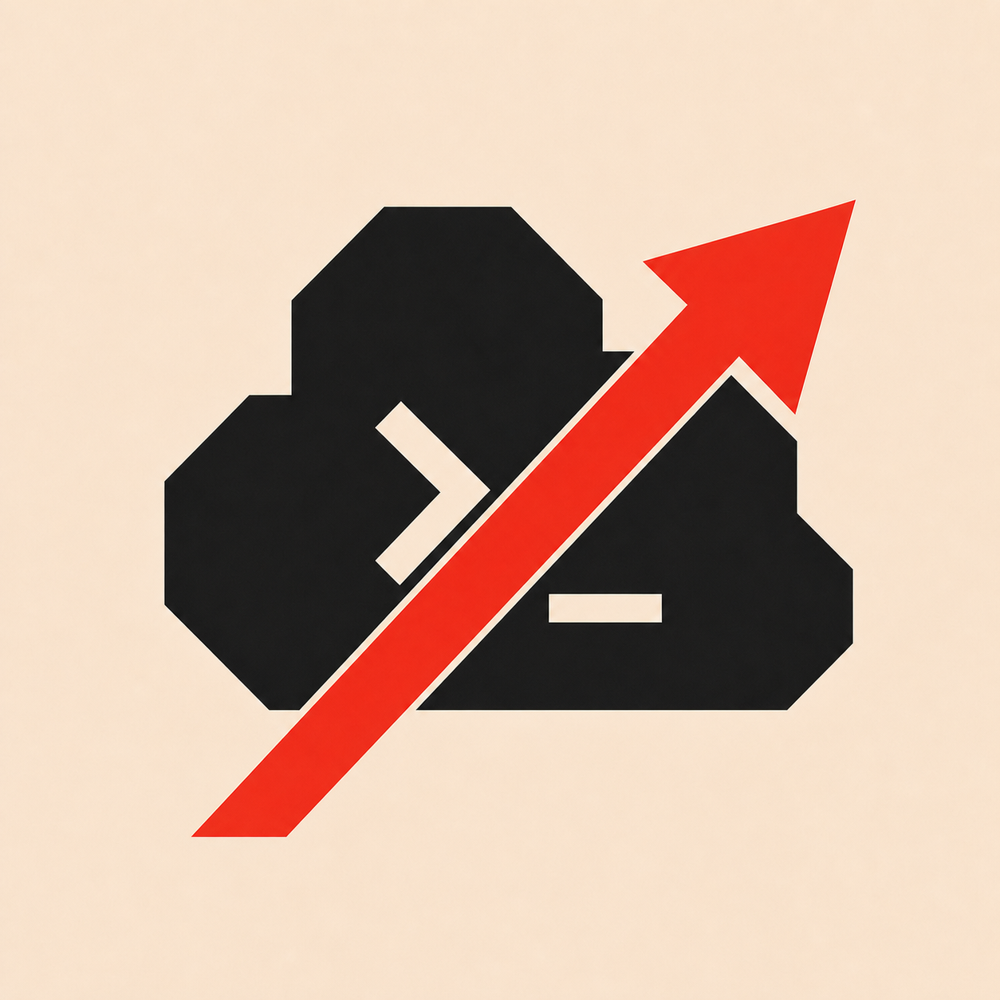

# Paper Workflow Orchestrator

**简体中文** | [English](README.md)



> 一个面向 Codex 的、可审计的科研到论文工作流控制器 —— 证据可追踪、完整性有闸门、默认安全。


## 概述

Paper Workflow Orchestrator 是一个 Codex skill，将完整的科研到论文流程 —— 从研究想法、文献、研究设计，到实验、写作、完整性审计、同行评审、修订和 AI 交接 —— 组织成带确认闸门的阶段化、证据可追踪流程。

主模型担任主编角色：负责路由、证据账本、提示词设计、冲突解决和最终合稿。Codex 内部子代理只执行边界清晰、可独立审查的任务。每个阶段结束前都会更新进度，并向用户提供 2–5 个下一步选项（其中一个标记为推荐项）；未经用户确认不会静默进入下一阶段。

## 核心特性

每条特性都对应本仓库中的具体组件：

| 特性 | 实现组件 |
|---|---|
| 带用户确认闸门的阶段化工作流 | `SKILL.md`、`references/stage-contracts.md` |
| 持久证据账本与进度记忆（v0.4） | `scripts/progress_manager.py`、`references/progress-schema.md` |
| 关键有效性问题阻断流程 | `references/progress-schema.md`、`SKILL.md` |
| 格式安全的 humanizer 适配器（fail-closed） | `scripts/humanizer_preflight.py`、`references/humanizer-adapter.md` |
| 安全的自主实验路由 | `scripts/experiment_contract_validator.py`、`SKILL.md` |
| 论文章节契约验证 | `scripts/paper_section_validator.py`、`references/paper-section-contract.md` |
| 四种入口模式（想法引导、草稿审计、写作/修订、实验） | `SKILL.md` |
| 边界清晰的子代理委派契约 | `references/stage-contracts.md` |
| 并发安全的只追加事件日志 | `scripts/progress_manager.py`、`tests/test_workflow_v04.py` |
| 零运行时依赖（仅 Python 标准库） | 全部 `scripts/*.py` |

## 工作流阶段

orchestrator 每个阶段路由一个主下游 skill。每个阶段产出必需的制品，并以用户闸门结束。

1. **入口诊断** —— 诊断输入，确认入口模式和约束
2. **方向探索** —— 探索 3–5 个候选研究方向
3. **文献发现** —— 发现并分拣已验证的来源
4. **题目筛选** —— 研究 gap / 贡献 / 可行性判定与问题锁定
5. **研究设计** —— 可证伪的研究设计与实验矩阵
6. **架构冻结** —— 冻结论文结构、章节画像、大纲
7. **协作写作** —— 边界清晰的内部代理写章节；主模型合稿
8. **完整性审计** —— 审计引用、数字、主张、泄漏、可复现性
9. **语言自然化** —— 格式安全的 humanizer 处理与主张/证据 diff
10. **同行评审** —— 评审模拟与修订矩阵
11. **终稿交付** —— 最终审计、交接卡片与交付

每个闸门处，用户会收到已完成的工作、进度快照、剩余风险、2–5 个下一步选项（一个标记为**推荐**），以及继续所需的明确确认。摘要只能在正文、结果、解释和结论稳定后撰写；结论始终是必需部分。

## 目录结构

```
paper-workflow-orchestrator/
├── SKILL.md                          # orchestrator skill 定义与路由
├── agents/
│   └── openai.yaml                   # agent 接口声明
├── references/
│   ├── paper-section-contract.md     # 标题/摘要/方法/结果/结论契约
│   ├── progress-schema.md            # 进度记忆 v0.4 schema 与错误规则
│   ├── stage-contracts.md            # 阶段表、委派与验收谓词
│   └── humanizer-adapter.md          # 格式安全 humanizer 适配器协议
├── scripts/
│   ├── progress_manager.py           # 进度初始化/验证/迁移/记录/恢复
│   ├── humanizer_preflight.py        # humanizer 预检（fail-closed）
│   ├── paper_section_validator.py    # 章节顺序与必需章节检查
│   └── experiment_contract_validator.py  # 有界实验合同验证器
└── tests/
    ├── __init__.py
    └── test_workflow_v04.py          # 端到端工作流测试
```

## 安装

将本目录复制到 Codex skills 目录（`CODEX_HOME/skills`，未设置 `CODEX_HOME` 时默认为 `~/.codex/skills`）。

**Windows PowerShell：**

```powershell
Copy-Item -Recurse -Force . $env:CODEX_HOME\skills\paper-workflow-orchestrator
```

**macOS / Linux：**

```bash
cp -R . "$HOME/.codex/skills/paper-workflow-orchestrator"
```

安装后重新打开 Codex，或重新加载 skills 列表。

## 使用方式

使用以下触发语句启动完整工作流：

```
Use paper-workflow-orchestrator to run a gated, evidence-tracked research-to-paper workflow.
```

该 skill 是工作流控制器，不是单一任务工具。当仅需文献矩阵、研究设计、论文润色或引用审计时，应让 `research-skill-router` 选择更窄的专用 skill，避免不必要地加载完整工作流。

## 本地验证

项目脚本只使用 Python 标准库。Python 3.10+ 可运行：

```bash
python -B tests/test_workflow_v04.py -v
# 或
python -B -m unittest discover -s tests -p "test_*.py" -v
```

测试会验证 progress v0.4、论文章节闸门、humanizer fail-closed 合同、关键阻断、并发写入、实验合同边界和安全路由。若未安装 Codex 的外部集成 skills，相关镜像测试会保留本地测试并跳过外部集成断言。

## 安全边界

- `autoresearch` 不会被自动加载，也不会在缺乏明确、完整、已验证合同的情况下启动无人值守实验。
- 子代理不能改变研究方向、修改最终稿、直接写 `progress.md`，或编造引用、数字和实验结果。
- humanizer 不能绕过格式适配器、保护清单、主张/证据 diff、完整性收据或回滚目标。
- DOCX、PDF 和 LaTeX 需要对应的格式适配器；解析能力不足时流程保持 `blocked`。
- 关键有效性问题不能通过改写摘要、结论或语言风格来掩盖。

## 贡献

欢迎贡献。提交变更前请运行完整测试套件，并保持所有脚本零依赖（仅 Python 标准库）。请勿提交个人论文、`.research/`、`.paper/`、实验数据、凭据或本机生成的缓存文件。

## 许可证

本项目基于 [MIT 许可证](LICENSE) 开源。
