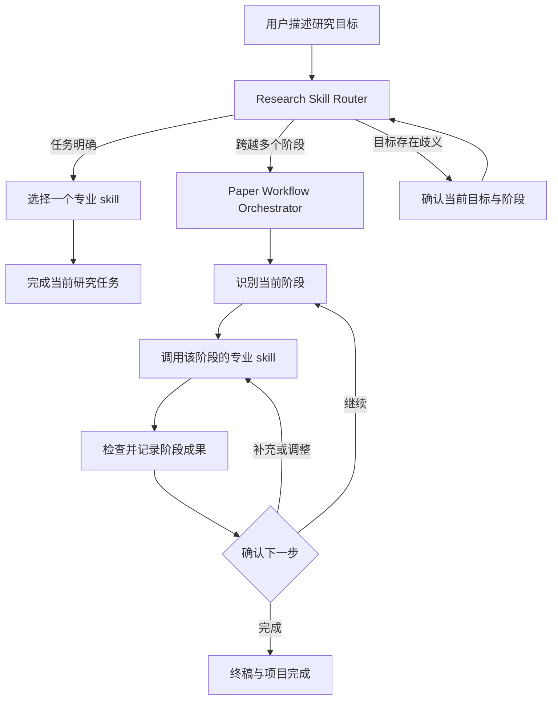
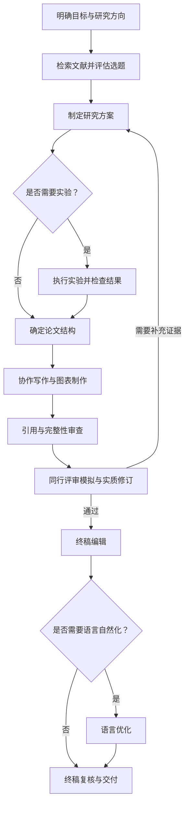

# Paper Workflow Orchestrator

**帮助您将任何一个模糊的想法落地为顶刊级别的论文。**

**简体中文** | [English](README.md)


Paper Workflow Orchestrator 是一套以 Codex skill 形式提供的科研工作流。它根据研究目标和项目阶段选择合适的专业 skill，并将选题、文献、研究设计、实验、写作、审查与终稿交付组织成一条连续、可追踪的论文生产流程。

它适合需要跨文件、跨会话持续推进的论文项目。你可以从一个模糊想法、已有草稿、已确定的研究方案或实验任务开始；工作流会识别当前阶段，调用相应能力，保存关键依据，并在重要决定处等待确认。

## 核心设计：Router Skills

完整论文项目会用到多种专业能力：研究方向探索、文献检索、选题评估、研究设计、实验、论文写作、科研绘图、引用审查和终稿编辑。Paper Workflow Orchestrator 在这些能力之上加入两层 Router Skills，让使用者可以直接从研究目标出发，由 Router 处理每个 skill 的选择范围和调用顺序。

- **`research-skill-router` 负责选择能力**：理解当前任务与研究阶段，从可用能力中选择一个最合适的主 skill。
- **`paper-workflow-orchestrator` 负责组织过程**：接管跨阶段项目，依次调用专业 skill，衔接阶段成果，并维护整个项目的进度、证据与决策。


```mermaid
flowchart TD
    U["用户描述研究目标"] --> R["Research Skill Router"]

    R -->|"任务明确"| S["选择一个专业 skill"]
    R -->|"跨越多个阶段"| O["Paper Workflow Orchestrator"]
    R -->|"目标存在歧义"| Q["确认当前目标与阶段"]
    Q --> R

    S --> T["完成当前研究任务"]

    O --> C["识别当前阶段"]
    C --> D["调用该阶段的专业 skill"]
    D --> V["检查并记录阶段成果"]
    V --> G{"确认下一步"}

    G -->|"继续"| C
    G -->|"补充或调整"| D
    G -->|"完成"| F["终稿与项目完成"]
```

### Router Skills 带来的改变

**用研究目标启动任务**

你可以直接提出“判断这个选题是否值得研究”“比较这组论文的方法差异”或“从现有草稿继续完成论文”。Router 会把请求映射到合适的能力，并在目标不够明确时先确认任务范围。

**一次聚焦一个主要能力**

方向探索、选题评估和研究设计彼此相关，但解决的问题不同。Router 根据当前阶段选择一个主 skill，使任务上下文保持清晰，减少相邻能力之间的指令干扰。

**保留专业 skill 的独立性**

文献检索、论文写作、科研绘图和完整性审查分别由专用 skill 处理。每项能力都可以独立使用、升级或替换，同时通过 Router 接入统一工作流。

**让阶段成果自然衔接**

文献证据影响选题，研究设计约束实验，实验结果决定论文主张，审查意见可能要求返回前面的阶段补充证据。Orchestrator 负责这些衔接关系，使上一阶段的结果成为下一阶段的有效输入。

**同时支持局部任务和长期项目**

边界明确的请求可以直接进入专业 skill；需要完整论文流程、持续进度记录或跨阶段协作的任务则进入 Orchestrator。同一套能力体系可以覆盖一次性研究任务和长期论文项目。

## 工作流程

工作流根据项目实际情况选择起点和路径。下面的流程图将内部阶段归纳为五个使用者可理解的部分，并展示实验、审查和修订形成的反馈回路。


```mermaid
flowchart TD
    A["明确目标与研究方向"] --> B["检索文献并评估选题"]
    B --> C["制定研究方案"]
    C --> D{"是否需要实验？"}

    D -->|"是"| E["执行实验并检查结果"]
    D -->|"否"| F["确定论文结构"]
    E --> F

    F --> G["协作写作与图表制作"]
    G --> H["引用与完整性审查"]
    H --> I["同行评审模拟与实质修订"]

    I -->|"需要补充证据"| C
    I -->|"通过"| J["终稿编辑"]

    J --> K{"是否需要语言自然化？"}
    K -->|"是"| L["语言优化"]
    K -->|"否"| M["终稿复核与交付"]
    L --> M
```

选题、研究方案、实验范围和终稿采纳等关键决定由用户确认。具体阶段、输入输出和验收规则记录在 [`references/stage-contracts.md`](references/stage-contracts.md) 中。

## 核心能力

| 能力 | 使用者获得的结果 | 主要实现 |
|---|---|---|
| 研究任务路由 | 根据研究意图和当前阶段选择一个主 skill | `companion-skills/research-skill-router/` |
| 完整论文编排 | 从研究想法或已有草稿持续推进到终稿交付 | `SKILL.md`、`references/stage-contracts.md` |
| 项目连续性 | 保存进度、证据、决定、风险和阶段衔接信息 | `scripts/progress_manager.py`、`references/progress-schema.md` |
| 研究与实验准备 | 在实验启动前明确研究问题、验证方法和执行范围 | `scripts/experiment_contract_validator.py` |
| 论文结构检查 | 检查必需章节及其顺序 | `scripts/paper_section_validator.py`、`references/paper-section-contract.md` |
| 科研图件工作流 | 将图件与数据来源、论文主张和验证记录关联 | `scripts/figure_contract_validator.py`、`references/scientific-visualization-integration.md` |
| 完整性与同行评审 | 检查引用、数字、主张、可复现性并组织实质修订 | `SKILL.md`、`references/stage-contracts.md` |
| 作者引导终稿编辑 | 根据作者反馈统一全文表达并验证受保护内容 | `companion-skills/academic-manuscript-final-editor/` |
| 语言自然化 | 在科学内容稳定后优化机械化表达并检查内容差异 | `scripts/humanizer_preflight.py`、`references/humanizer-adapter.md` |
| 可复现安装 | 使用固定来源安装 core、standard 或 full 配置 | `dependencies.lock.json`、`scripts/install_workflow.py` |

编排器核心脚本使用 Python 标准库，适用于 Python 3.10 及以上版本。

## 适用场景

- 只有初步研究想法，需要逐步形成可验证的研究问题。
- 已有一组论文，需要比较方法、数据、结论与局限。
- 已确定选题，需要完成研究设计、实验计划和论文结构。
- 已有草稿，需要检查引用、主张、图表和论证完整性。
- 需要组织多轮写作、评审、修订与终稿编辑。
- 需要在多个 Codex 会话之间延续项目状态。
- 只知道想完成的研究任务，希望由 Router 选择合适的专业 skill。

## 快速安装

克隆仓库并运行安装器：

```bash
git clone https://github.com/shuohui-air-technology/codex-paper-workflow.git
cd codex-paper-workflow
python3 scripts/install_workflow.py
```

如果 `python` 已指向 Python 3，也可以使用：

```bash
python scripts/install_workflow.py
```

Windows 可以使用：

```powershell
py -3 scripts/install_workflow.py
```

默认安装 `standard` 配置。安装完成后，重新打开 Codex，或重新加载 skills 列表。

### 安装配置

| 配置 | 内容 | 适合场景 |
|---|---|---|
| `core` | Orchestrator、Research Skill Router 和仓库内置终稿编辑能力 | 离线安装、最小工作流 |
| `standard` | `core` 加上研究、写作、审稿、语言自然化和科研绘图能力 | 大多数论文项目 |
| `full` | `standard` 加上自主实验与 ARA 审查能力 | 已明确实验合同与高级审查需求的项目 |

常用命令：

```bash
# 预览 standard 配置将执行的操作
python3 scripts/install_workflow.py --profile standard --dry-run

# 验证当前安装
python3 scripts/install_workflow.py --profile standard --verify

# 更新到锁定清单中的版本
python3 scripts/install_workflow.py --profile standard --update

# 将现有配置缩小为 core，并备份后移除多余的托管 skill
python3 scripts/install_workflow.py --profile core --update --prune
```

`dependencies.lock.json` 记录外部 skill 的仓库、目录、固定提交和许可证。安装器根据该清单完成下载、校验和更新，并在本地生成 `.paper-workflow-install.json` 安装记录。

`core` 配置支持离线安装。`standard` 和 `full` 通过 HTTPS 获取清单中指定的外部 skill，需要访问 GitHub。

科研图件功能使用 Python 3.11+、`uv` 和所选绘图库。完成 skill 安装后，请根据绘图任务配置相应的 Python 运行环境。

<details>
<summary>手动安装仓库内置 skills</summary>

### Windows PowerShell

在仓库根目录执行：

```powershell
$skillsHome = if ($env:CODEX_HOME) { Join-Path $env:CODEX_HOME 'skills' } else { Join-Path ([Environment]::GetFolderPath('UserProfile')) '.codex\skills' }
$main = Join-Path $skillsHome 'paper-workflow-orchestrator'
New-Item -ItemType Directory -Force -Path $main | Out-Null
Copy-Item -Recurse -Force SKILL.md, agents, assets, references, scripts $main
Copy-Item -Force LICENSE (Join-Path $main 'LICENSE')

$finalEditor = Join-Path $skillsHome 'academic-manuscript-final-editor'
$router = Join-Path $skillsHome 'research-skill-router'
New-Item -ItemType Directory -Force -Path $finalEditor, $router | Out-Null
Copy-Item -Recurse -Force companion-skills\academic-manuscript-final-editor\* $finalEditor
Copy-Item -Recurse -Force companion-skills\research-skill-router\* $router
```

### macOS / Linux

在仓库根目录执行：

```bash
SKILLS_HOME="${CODEX_HOME:-$HOME/.codex}/skills"
mkdir -p "$SKILLS_HOME/paper-workflow-orchestrator"
cp -R SKILL.md agents assets references scripts "$SKILLS_HOME/paper-workflow-orchestrator/"
cp -f LICENSE "$SKILLS_HOME/paper-workflow-orchestrator/LICENSE"

mkdir -p "$SKILLS_HOME/academic-manuscript-final-editor" "$SKILLS_HOME/research-skill-router"
cp -R companion-skills/academic-manuscript-final-editor/. "$SKILLS_HOME/academic-manuscript-final-editor/"
cp -R companion-skills/research-skill-router/. "$SKILLS_HOME/research-skill-router/"
```

</details>

## 使用方式

### 启动完整论文工作流

```text
使用 paper-workflow-orchestrator，从当前研究材料开始运行带阶段确认和进度记录的完整论文工作流。
```

### 从已有草稿开始

```text
使用 paper-workflow-orchestrator 审查这份草稿，识别当前阶段、证据缺口和下一步修订计划。
```

### 让 Router 选择专业 skill

```text
使用 research-skill-router 判断这个研究任务应该交给哪个 skill：比较这些论文的方法、数据和主要结论。
```

### 启动范围明确的实验

```text
使用 paper-workflow-orchestrator 为这个实验建立合同，确认目标、资源、评估方法和停止条件后再开始执行。
```

单一、明确的研究任务由 `research-skill-router` 选择专业能力；需要跨阶段推进或项目进度记录的任务由 `paper-workflow-orchestrator` 负责。

## 项目结构

```text
paper-workflow-orchestrator/
├── SKILL.md                              # Orchestrator 定义与阶段路由
├── agents/
│   └── openai.yaml                       # Agent 接口声明
├── assets/                               # Logo 与 README 横幅
├── references/
│   ├── paper-section-contract.md         # 论文章节契约
│   ├── progress-schema.md                # 项目进度与证据记录格式
│   ├── stage-contracts.md                # 阶段、委派与验收规则
│   ├── scientific-visualization-integration.md
│   ├── final-editor-integration.md
│   └── humanizer-adapter.md
├── scripts/
│   ├── progress_manager.py               # 进度初始化、迁移、记录与恢复
│   ├── install_workflow.py               # 跨平台固定版本安装器
│   ├── experiment_contract_validator.py  # 实验合同验证
│   ├── figure_contract_validator.py      # 科研图件验证
│   ├── paper_section_validator.py        # 论文章节验证
│   ├── final_edit_receipt_validator.py   # 终稿编辑结果验证
│   └── humanizer_preflight.py            # 语言自然化预检
├── dependencies.lock.json                # 外部 skill 来源与版本清单
├── tests/                                 # 工作流与安装器测试
└── companion-skills/
    ├── research-skill-router/             # 科研任务路由入口
    └── academic-manuscript-final-editor/  # 作者引导终稿编辑
```

## 第三方 skill 来源

外部 skill 按照 [`dependencies.lock.json`](dependencies.lock.json) 中记录的固定提交获取。清单同时记录每个上游项目的许可证：

- K-Dense 科研绘图：MIT
- research-hub：MIT
- Orchestra AI Research Skills：MIT
- humanizer：MIT
- Academic Research Skills：CC BY-NC 4.0

`clarify-research-idea` 的固定上游仓库当前未声明许可证，使用或重新分发时应单独核对其授权条款。

安装 skill 时，各上游项目仍适用其原始许可证。

## 贡献

欢迎提交问题和改进建议。代码贡献应保持编排器核心脚本仅使用 Python 标准库，并在 Pull Request 中说明验证方式。

个人论文、`.research/`、`.paper/`、实验数据、凭据和本机缓存应保留在本地，并由 `.gitignore` 管理。

## 许可证

本项目基于 [MIT 许可证](LICENSE) 开源。
